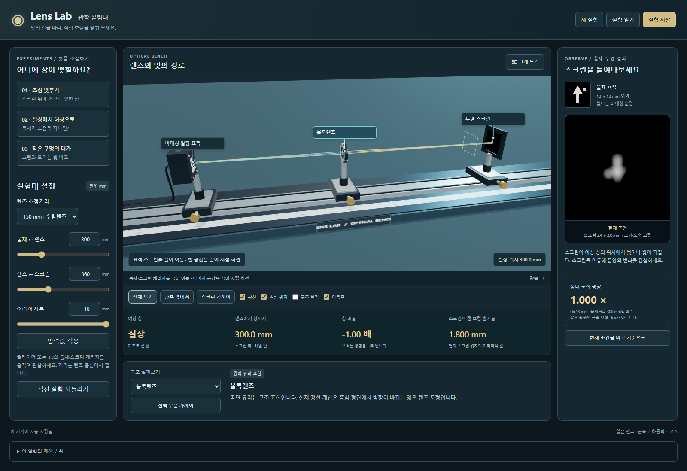

# Lens Lab

물체·렌즈·스크린을 움직여 초점, 실상과 허상, 조리개의 영향을 관찰하는 한국어 Windows 광학 실험대입니다. **실험대 구조를 살펴보고, 세 가지 안내 실험과 자유 탐구로 빛의 경로를 비교합니다.**



배포된 버전의 Windows 설치 파일과 SHA-256 확인 파일은 [최신 릴리스](https://github.com/Ulsancl/lens-lab/releases/latest)에서 확인하세요. 설치 후 바탕화면이나 시작 메뉴의 **Lens Lab** 아이콘으로 실행합니다.

렌즈 중심을 기준으로 물체거리와 스크린거리를 조절하고, 초점거리 150 / 225 / 300 mm와 조리개 지름 6–18 mm를 비교합니다. 광선과 스크린 영상은 같은 얇은 렌즈 모형을 사용합니다. 별도 검사 화면과 3D 스크린에는 같은 투영 결과를 표시합니다. 조건을 바꾸면 즉시 다시 계산하며 시간이나 재생 배율은 사용하지 않습니다.

이름표는 연결선으로 해당 부품을 가리키며 선택 부품 가까이 보기로 구조를 관찰합니다. 폭이 좁은 화면에서는 조절 옆의 현재 영상과 흐림·광량 수치를 보면서 설정을 바꿀 수 있습니다. 현재·보관 영상을 같은 48×48 mm 영역, 192×192 표본, 화면 크기와 노출에서 번갈아 비교합니다. 보관 영상을 보는 동안에도 계측값과 3D는 현재 조건이며, 조건을 바꾸면 현재 영상으로 돌아옵니다.

세 실험은 뒤집힌 실상에 초점을 맞추기, 물체를 초점 안쪽까지 옮겨 실상·평행광·허상을 구분하기, 조리개를 줄일 때 기하학적 흐림과 상대 광량을 비교하기입니다. 관찰 안내는 실제 조작과 확인에 연결되며, 안내 진행은 현재 세션에서만 유지합니다. 파일은 광학 설정·비교 조건·표시 옵션·선택 부품·카메라를 보관합니다.

**얇은 렌즈·근축 기하광학 모형**입니다. 유리 곡면은 구조 표현이고 굴절은 중심 평면에서 계산합니다. 회절·수차·유리 두께·파장별 굴절·실제 투과 손실은 계산하지 않습니다. 표시 광량은 무차원 상대값이며 lux나 측정 장비의 조도가 아닙니다. 허상은 역연장으로 설명하며 실제 스크린에 선명한 허상을 붙이지 않습니다. 특정 제조사 제품의 설계도·성능 예측기·수리 지침이 아닙니다.

## 개발 실행

Node.js 24 계열의 터미널에서 실행합니다.

```powershell
npm ci
npm run dev
```

`npm test`는 광학·투영·기하·저장·원자적 파일 저장 검사를 실행합니다. `npm run test:browser`는 세 실험과 조작·저장을, `npm run test:consumer`는 구조 관찰 화면을 검사합니다. `npm run build`는 웹 산출물, `npm run desktop`은 독립 데스크톱 창, `npm run package:desktop`은 Windows x64 설치 파일과 SHA-256 파일을 만듭니다. 네이티브 검사는 `node scripts/desktop.mjs prepare-test`로 번들을 준비한 뒤 `npm run test:desktop`을 실행합니다. 실제 화면을 쓰는 브라우저·네이티브 검사는 동시에 실행하지 마세요.

설치 앱은 로컬 파일로 실행합니다. 개발 의존성 설치와 빌드 준비에는 인터넷이 필요할 수 있습니다. 대상은 Windows 11 x64이며 실제 호환성은 각 검사 기록을 따릅니다. 설치 파일은 코드 서명과 자동 업데이트를 제공하지 않습니다. 새 버전은 실험을 저장하고 앱을 닫은 뒤 설치 파일로 수동 업데이트합니다.

## 안내

- [세 실험](docs/experiments.md), [모형과 한계](docs/model.md), [실험대 구조](docs/anatomy.md).
- [저장과 복원](docs/storage.md), [Windows 앱](docs/desktop.md), [개인정보](docs/privacy.md).
- [유한한 완성 기준](docs/release-scope.md), [문제 보고](docs/support.md).
- [원리 참고](docs/references.md), [제3자 고지](docs/THIRD-PARTY-NOTICES.md).

직접 작성한 코드·문서·기하·아이콘은 `LICENSE.txt`의 UNLICENSED 표기를 따릅니다. 외부 라이브러리에는 각자의 라이선스가 적용됩니다. 제조사 사진·도면·CAD·온라인 폰트는 포함하지 않습니다.
